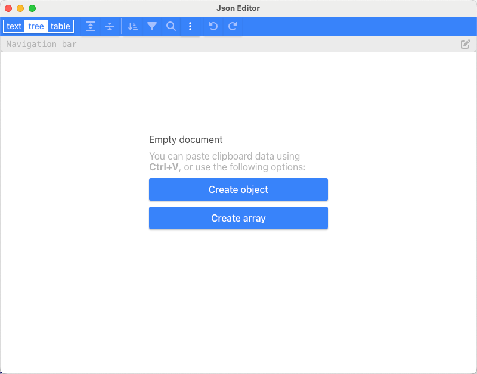
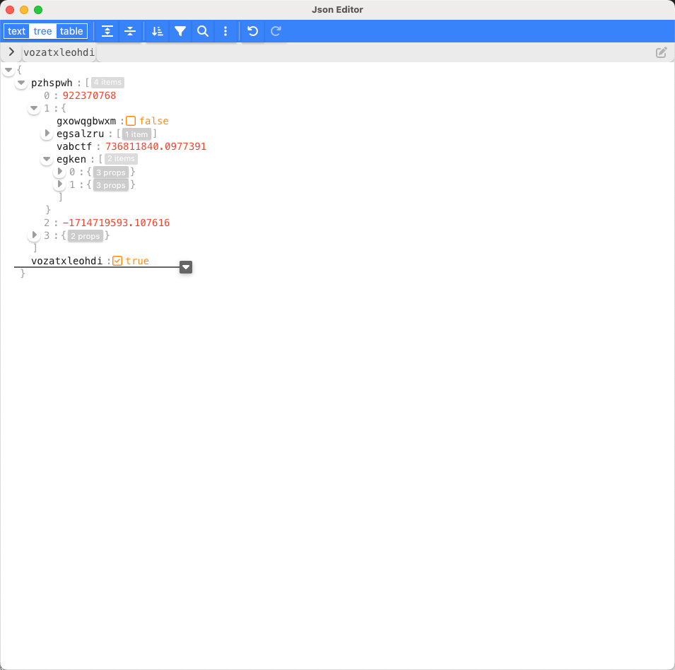
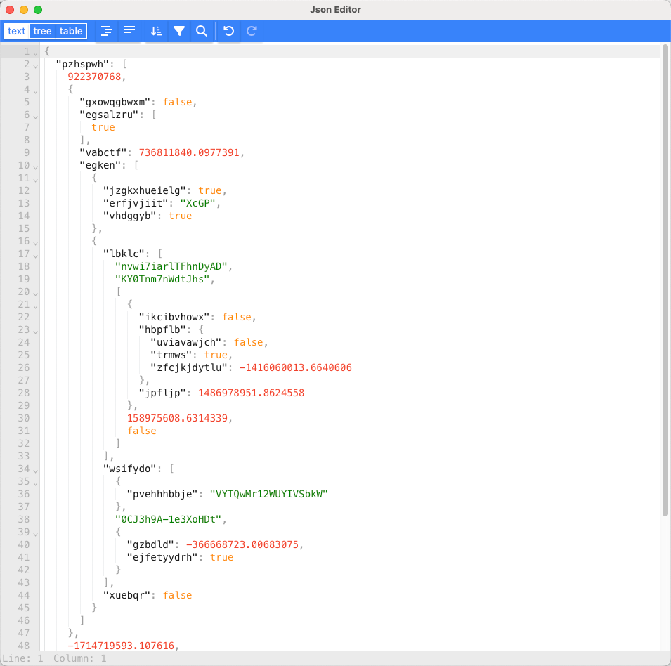

# JSON处理工具

<div align="center">
  
</div>

<div align="center">
  <a href="#">
    
  </a>
  <a href="LICENSE">
    
  </a>
  <a href="#">
    
  </a>
  <a href="#">
    
  </a>
  <a href="#">
    
  </a>
  <a href="docs/macOS安装问题解决指南.md">
    
  </a>
</div>

一个基于 Tauri 2.0 构建的JSON编辑和处理工具，集成了vanilla-jsoneditor组件，支持JSON数据的编辑、格式化和编辑。

## 应用截图

<div align="center">
  <h2>💡 直观强大的JSON处理体验</h2>
  <p>基于vanilla-jsoneditor打造的现代化JSON编辑工具，兼具易用性和专业性</p>
  <br>

  <h3>📱 主界面</h3>
  <p>强大易用的JSON编辑器界面，支持多种视图模式</p>
  <kbd>
    
  </kbd>
  <br><br>
  
  <h3>✏️ JSON编辑功能</h3>
  <p>直观的树状视图编辑，轻松处理复杂JSON数据</p>
  <kbd>
    
  </kbd>
  <br><br>
  
  <h3>📊 数据可视化展示</h3>
  <p>清晰的数据结构展示，让JSON一目了然</p>
  <kbd>
    
  </kbd>
</div>

## 功能特点

- ✨ 基于强大的vanilla-jsoneditor组件的JSON编辑器
- 📊 一键将JSON数据导出为Excel文件【规划中】
- 💪 基于Tauri 2.0构建，目前支持macOS，Windows和Linux版本正在规划中
- 🚀 原生性能体验，轻量快速
- 🔍 直观的JSON数据可视化

## 适用场景

本工具适用于以下场景：

- 💻 **开发调试**：快速查看、编辑和格式化API响应或配置文件
- 🔧 **数据处理**：清理、转换或整理JSON数据结构
- 📋 **配置管理**：编辑应用程序配置文件，确保符合正确的JSON格式
- 📊 **数据分析**：查看复杂的JSON数据结构，导出为Excel进行进一步分析【规划中】
- 🔍 **错误排查**：检查和修复JSON格式错误

## 技术栈

- **前端**：React、TypeScript、Ant Design
- **后端**：Rust（Tauri）
- **编辑器组件**：vanilla-jsoneditor (由svelte-jsoneditor提供)
- **Excel处理**：xlsxwriter (Rust) 【规划中】

## 详细技术栈

本项目使用了以下优秀的开源组件和库：

### 前端

| 组件 | 版本 | 仓库/文档链接 | 说明 |
| --- | --- | --- | --- |
| [React](https://react.dev/) | ^18.2.0 | [GitHub](https://github.com/facebook/react) | 用户界面构建库 |
| [TypeScript](https://www.typescriptlang.org/) | ^5.2.2 | [GitHub](https://github.com/microsoft/TypeScript) | JavaScript的类型化超集 |
| [Ant Design](https://ant.design/) | ^5.22.3 | [GitHub](https://github.com/ant-design/ant-design) | 企业级UI设计语言和React组件库 |
| [vanilla-jsoneditor](https://github.com/josdejong/svelte-jsoneditor) | ^2.3.2 | [GitHub](https://github.com/josdejong/vanilla-jsoneditor) | 强大的JSON编辑器组件 |

### 桌面应用框架

| 组件 | 版本 | 仓库/文档链接 | 说明 |
| --- | --- | --- | --- |
| [Tauri](https://tauri.app/) | ^2.0 | [GitHub](https://github.com/tauri-apps/tauri) | 构建更小、更快、更安全的桌面应用程序 |
| [@tauri-apps/api](https://tauri.app/v1/api/js/) | ^2.0.1 | [GitHub](https://github.com/tauri-apps/tauri) | Tauri JS API |
| [@tauri-apps/plugin-dialog](https://tauri.app/v1/api/js/dialog) | ^2.2.0 | [GitHub](https://github.com/tauri-apps/plugins-workspace/tree/v1/plugins/dialog) | 显示原生对话框 |
| [@tauri-apps/plugin-fs](https://tauri.app/v1/api/js/fs) | ^2.2.0 | [GitHub](https://github.com/tauri-apps/plugins-workspace/tree/v1/plugins/fs) | 文件系统访问API |
| [@tauri-apps/plugin-shell](https://tauri.app/v1/api/js/shell) | ^2 | [GitHub](https://github.com/tauri-apps/plugins-workspace/tree/v1/plugins/shell) | 执行系统命令 |

### 构建工具

| 组件 | 版本 | 仓库/文档链接 | 说明 |
| --- | --- | --- | --- |
| [Vite](https://vitejs.dev/) | ^5.3.1 | [GitHub](https://github.com/vitejs/vite) | 前端构建工具 |
| [@vitejs/plugin-react](https://github.com/vitejs/vite-plugin-react) | ^4.2.1 | [GitHub](https://github.com/vitejs/vite-plugin-react) | React插件 |

### 后端 (Rust)

| 组件 | 版本 | 仓库/文档链接 | 说明 |
| --- | --- | --- | --- |
| [serde](https://serde.rs/) | 1.0 | [GitHub](https://github.com/serde-rs/serde) | 序列化和反序列化框架 |
| [serde_json](https://docs.serde.rs/serde_json/) | 1.0 | [GitHub](https://github.com/serde-rs/json) | JSON支持 |
| [xlsxwriter](https://docs.rs/xlsxwriter/) | 0.6.0 | [GitHub](https://github.com/informationsea/xlsxwriter-rs) | Excel文件生成库【规划中】 |
| [tempfile](https://docs.rs/tempfile/) | 3.10.1 | [GitHub](https://github.com/Stebalien/tempfile) | 临时文件创建 |
| [chrono](https://docs.rs/chrono/) | 0.4 | [GitHub](https://github.com/chronotope/chrono) | 日期和时间库 |

## 安装和使用

### 从源码构建

1. 确保你已安装以下依赖：
   - Node.js (>= 16)
   - Rust (>= 1.70)
   - Tauri CLI

2. 克隆仓库并安装依赖：

```bash
git clone <repository-url>
cd develop-tool
npm install
```

3. 开发模式运行：

```bash
npm run tauri dev
```

4. 构建生产版本：

```bash
npm run tauri build
```

### 使用预构建版本

您可以从[发行版页面](https://gitee.com/您的用户名/develop-tool/releases)下载最新的预构建版本：

- **macOS**: 下载 `.dmg` 文件，打开并将应用拖到应用程序文件夹（[安装问题？点击这里](docs/macOS安装问题解决指南.md)）
- **Windows**: 即将推出，敬请期待
- **Linux**: 即将推出，敬请期待

> **注意**: 目前仅提供macOS版本，Windows和Linux版本正在开发中，将在后续版本中发布。

> **等不及了？** 如果您迫不及待想在Windows或Linux上使用，可以按照上方"从源码构建"的说明克隆仓库并自行打包。本项目基于Tauri 2.0构建，您可以参考[Tauri官方文档](https://tauri.app/distribute/)了解如何在不同平台上构建应用。通常只需执行`npm run tauri build`即可在您当前的操作系统上构建适用的安装包。

#### macOS用户注意事项

macOS用户可能会遇到一些与系统安全性相关的安装问题。我们提供了详细的[macOS安装问题解决指南](docs/macOS安装问题解决指南.md)，包含以下内容：

- 解决"无法验证开发者"错误
- 处理"应用程序已损坏"提示
- 配置必要的系统权限
- 应用程序签名问题
- 更多疑难解答步骤

## 使用指南

1. **编辑JSON**：在编辑器区域直接编辑或粘贴JSON数据
2. **导出Excel**：点击工具栏中的"导出Excel"按钮，选择保存位置即可【规划中】

## 主要功能实现

### JSON编辑器

本应用使用vanilla-jsoneditor组件提供JSON编辑功能，支持以下特性：

- 树状视图和文本视图切换
- 语法高亮
- 自动格式化
- 错误验证

### JSON转Excel【规划中】

规划使用Rust的xlsxwriter库实现JSON到Excel的转换：

- 自动识别JSON数组中的键作为表头
- 将JSON数组数据映射为Excel表格行
- 支持各种数据类型转换

## 项目结构

```
develop-tool/
├── src/                      # 前端源码
│   ├── App.tsx               # 主应用组件
│   ├── VanillaJSONEditor.tsx # JSON编辑器组件封装
│   └── ...
├── src-tauri/                # Tauri/Rust后端代码
│   ├── src/
│   │   └── main.rs           # 主Rust代码（含JSON转Excel实现）
│   ├── icons/                # 应用图标资源
│   │   ├── 32x32.png         # 各种尺寸的应用图标
│   │   ├── 128x128.png
│   │   ├── icon.icns         # macOS图标
│   │   └── icon.ico          # Windows图标
│   ├── Cargo.toml            # Rust依赖管理
│   └── tauri.conf.json       # Tauri配置
├── screenshots/              # 应用截图（用于README展示）
│   ├── app.png               # 主界面截图
│   ├── image.png             # JSON编辑功能截图
│   └── image02.png           # 数据可视化展示截图
├── docs/                     # 文档目录
│   └── macOS安装问题解决指南.md # macOS安装问题解决指南
└── package.json              # 前端依赖管理
```

## 应用图标

本应用使用了精美的图标资源，主要包括以下格式：

- **Windows**: icon.ico 和各种尺寸的 Square*.png
- **macOS**: icon.icns
- **Linux/通用**: 各种尺寸的PNG图标 (32x32.png, 128x128.png, 128x128@2x.png 等)

这些图标位于 `src-tauri/icons/` 目录中，可以根据需要进行自定义替换。

## 许可证

本项目采用 [MIT 许可证](LICENSE)。

MIT许可证是一种宽松的软件许可证，简单来说：

- ✅ 可以自由使用、复制、修改、合并、发布、分发、再许可及销售本软件的副本
- ✅ 可以用于商业用途
- ✅ 可以修改源代码并保持私有
- ⚠️ 唯一的限制是必须在所有副本中包含上述版权声明和许可声明

详细条款请查看 [LICENSE](LICENSE) 文件。

## 贡献指南

我们非常欢迎并感谢所有形式的贡献！如果您想为本项目做出贡献，请遵循以下步骤：

1. Fork 本仓库
2. 创建您的特性分支 (`git checkout -b feature/AmazingFeature`)
3. 提交您的更改 (`git commit -m 'Add some AmazingFeature'`)
4. 推送到分支 (`git push origin feature/AmazingFeature`)
5. 打开一个 Pull Request

### 贡献类型

您可以通过多种方式为项目做出贡献：

- 🐛 报告bug
- 💡 提出新功能或改进建议
- 🔍 审查代码
- 📝 改进文档
- 💻 提交代码

## 鸣谢

<div align="center">
  <a href="https://tauri.app">
    
  </a>
  <a href="https://github.com/josdejong/svelte-jsoneditor">
    
  </a>
  <a href="https://react.dev">
    
  </a>
  <a href="https://ant.design">
    
  </a>
  <a href="https://www.typescriptlang.org">
    
  </a>
  <a href="https://vitejs.dev">
    
  </a>
</div>

本项目依赖于以下优秀的开源项目：

- [Tauri](https://tauri.app/) - 提供桌面应用程序框架
- [vanilla-jsoneditor](https://github.com/josdejong/vanilla-jsoneditor) - 提供强大的JSON编辑功能
- [React](https://react.dev/) - 用户界面构建库
- [Ant Design](https://ant.design/) - 企业级UI设计语言和React组件库
- [TypeScript](https://www.typescriptlang.org/) - JavaScript的类型化超集
- [Vite](https://vitejs.dev/) - 前端构建工具
- [xlsxwriter](https://github.com/informationsea/xlsxwriter-rs) - 提供Excel文件创建功能【规划中】

## 联系与支持

如果您在使用过程中遇到任何问题或有任何建议，请通过以下方式联系我们：

- 提交 [Issues](https://github.com/您的用户名/develop-tool/issues)
- 发送邮件至：[522caiji@163.com]
- macOS用户可查阅[安装问题解决指南](docs/macOS安装问题解决指南.md)

我们会尽快回复您的问题和建议。
